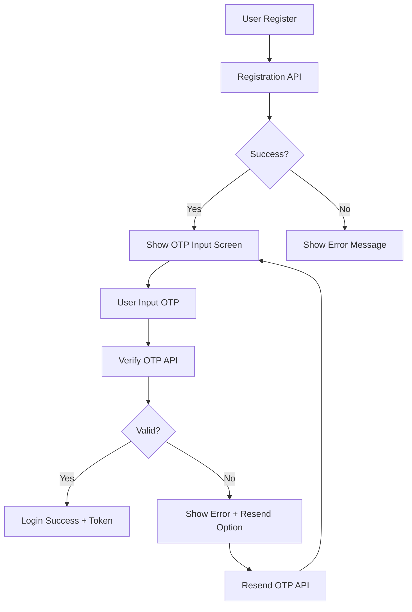
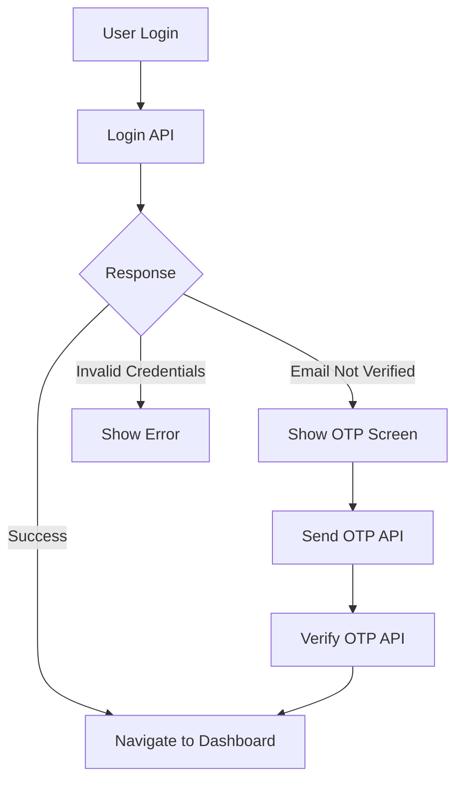
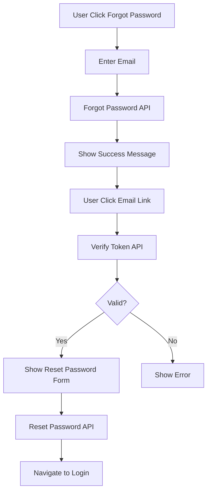

# UDKS API Documentation - Email Verification & Password Reset

## Base URL
```
https://yourdomain.com/api
```

## Rate Limiting
- **Send OTP**: 3 requests per minute
- **Verify OTP**: 5 requests per minute  
- **Resend OTP**: 2 requests per minute
- **Forgot Password**: 3 requests per minute
- **Reset Password**: 5 requests per minute

---

## 🔐 Authentication & Email Verification

### 1. User Registration
```http
POST /register
```

**Request Body:**
```json
{
    "full_name": "John Doe",
    "username": "johndoe",
    "email": "user@example.com",
    "password": "password123"
}
```

**Success Response (201):**
```json
{
    "success": true,
    "message": "Registrasi berhasil. Kode OTP telah dikirim ke email Anda untuk verifikasi.",
    "data": {
        "id": 1,
        "full_name": "John Doe",
        "username": "johndoe",
        "email": "user@example.com",
        "role": "Pengecer",
        "phone_number": null,
        "email_verified_at": null,
        "created_at": "2025-01-01T10:00:00.000000Z",
        "updated_at": "2025-01-01T10:00:00.000000Z"
    },
    "requires_verification": true,
    "expires_at": "2025-01-01T10:10:00.000000Z"
}
```

**Error Response (422):**
```json
{
    "email": ["The email has already been taken."],
    "username": ["The username has already been taken."]
}
```

---

### 2. Send OTP for Email Verification
```http
POST /send-otp
```

**Request Body:**
```json
{
    "email": "user@example.com"
}
```

**Success Response (200):**
```json
{
    "success": true,
    "message": "Kode OTP telah dikirim ke email Anda",
    "expires_at": "2025-01-01T10:10:00.000000Z"
}
```

**Error Responses:**
```json
// Email not found (422)
{
    "success": false,
    "message": "Email tidak valid atau tidak terdaftar",
    "errors": {
        "email": ["The selected email is invalid."]
    }
}

// Already verified (400)
{
    "success": false,
    "message": "Email sudah terverifikasi"
}

// Email sending failed (500)
{
    "success": false,
    "message": "Gagal mengirim email. Silakan coba lagi."
}
```

---

### 3. Verify OTP
```http
POST /verify-otp
```

**Request Body:**
```json
{
    "email": "user@example.com",
    "otp": "123456"
}
```

**Success Response (200):**
```json
{
    "success": true,
    "message": "Email berhasil diverifikasi",
    "data": {
        "id": 1,
        "full_name": "John Doe",
        "username": "johndoe",
        "email": "user@example.com",
        "role": "Pengecer",
        "phone_number": null,
        "email_verified_at": "2025-01-01T10:05:00.000000Z",
        "created_at": "2025-01-01T10:00:00.000000Z",
        "updated_at": "2025-01-01T10:05:00.000000Z"
    },
    "access_token": "eyJ0eXAiOiJKV1QiLCJhbGciOiJSUzI1NiJ9...",
    "token_type": "Bearer"
}
```

**Error Responses:**
```json
// Invalid OTP (400)
{
    "success": false,
    "message": "Kode OTP tidak valid"
}

// Expired OTP (400)
{
    "success": false,
    "message": "Kode OTP sudah kedaluwarsa"
}

// Validation error (422)
{
    "success": false,
    "message": "Data tidak valid",
    "errors": {
        "otp": ["The otp field must be 6 characters."]
    }
}
```

---

### 4. Resend OTP
```http
POST /resend-otp
```

**Request Body:**
```json
{
    "email": "user@example.com"
}
```

**Response:** Same as Send OTP endpoint

---

### 5. Login with Email Verification Check
```http
POST /login
```

**Request Body:**
```json
{
    "email": "user@example.com",
    "password": "password123"
}
```

**Success Response (200):**
```json
{
    "success": true,
    "access_token": "eyJ0eXAiOiJKV1QiLCJhbGciOiJSUzI1NiJ9...",
    "token_type": "Bearer",
    "data": {
        "id": 1,
        "full_name": "John Doe",
        "username": "johndoe",
        "email": "user@example.com",
        "role": "Pengecer",
        "email_verified_at": "2025-01-01T10:05:00.000000Z"
    }
}
```

**Error Responses:**
```json
// Invalid credentials (401)
{
    "message": "Invalid login details"
}

// Email not verified (403)
{
    "success": false,
    "message": "Email belum diverifikasi. Silakan verifikasi email Anda terlebih dahulu.",
    "requires_verification": true,
    "email": "user@example.com"
}
```

---

## 🔑 Password Reset

### 6. Send Password Reset Link
```http
POST /forgot-password
```

**Request Body:**
```json
{
    "email": "user@example.com"
}
```

**Success Response (200):**
```json
{
    "success": true,
    "message": "Link reset password telah dikirim ke email Anda"
}
```

**Error Response (422):**
```json
{
    "success": false,
    "message": "Email tidak ditemukan",
    "errors": {
        "email": ["We can't find a user with that email address."]
    }
}
```

---

### 7. Verify Reset Token
```http
POST /verify-reset-token
```

**Request Body:**
```json
{
    "token": "reset-token-from-email"
}
```

**Success Response (200):**
```json
{
    "success": true,
    "message": "Token valid",
    "email": "user@example.com"
}
```

**Error Response (400):**
```json
{
    "success": false,
    "message": "Token tidak valid atau sudah kedaluwarsa"
}
```

---

### 8. Reset Password
```http
POST /reset-password
```

**Request Body:**
```json
{
    "token": "reset-token-from-email",
    "email": "user@example.com",
    "password": "newpassword123",
    "password_confirmation": "newpassword123"
}
```

**Success Response (200):**
```json
{
    "success": true,
    "message": "Password berhasil direset"
}
```

**Error Responses:**
```json
// Validation error (422)
{
    "success": false,
    "message": "Data tidak valid",
    "errors": {
        "password": ["The password field must be at least 8 characters."],
        "password_confirmation": ["The password confirmation does not match."]
    }
}

// Invalid token (400)
{
    "success": false,
    "message": "Token tidak valid atau sudah kedaluwarsa"
}
```

---

## 📱 Mobile Implementation Flow

### Registration Flow:


### Login Flow:


### Forgot Password Flow:


---

## 📋 Important Notes

### OTP Behavior:
- **Expiry Time**: 10 minutes
- **Code Length**: 6 digits
- **One Time Use**: OTP becomes invalid after successful verification
- **New OTP**: Previous OTP is invalidated when new one is generated

### Email Templates:
- **From**: no-reply@udkeluargasehati.com
- **Name**: UDKS App
- **OTP Subject**: "Kode Verifikasi Email - UDKS"
- **Reset Subject**: "Reset Password - UDKS"

### Security Features:
- Rate limiting on all endpoints
- OTP auto-expiry
- Password strength validation (min 8 characters)
- Email validation
- Token-based authentication

### Error Handling:
- Always check `success` field in response
- Handle rate limiting (429 status code)
- Implement retry logic for network failures
- Show user-friendly error messages

---

## 🔧 Testing Endpoints

Use these curl commands for testing:

**Register:**
```bash
curl -X POST https://yourdomain.com/api/register \
  -H "Content-Type: application/json" \
  -d '{"full_name":"Test User","username":"testuser","email":"test@example.com","password":"password123"}'
```

**Send OTP:**
```bash
curl -X POST https://yourdomain.com/api/send-otp \
  -H "Content-Type: application/json" \
  -d '{"email":"test@example.com"}'
```

**Verify OTP:**
```bash
curl -X POST https://yourdomain.com/api/verify-otp \
  -H "Content-Type: application/json" \
  -d '{"email":"test@example.com","otp":"123456"}'
```